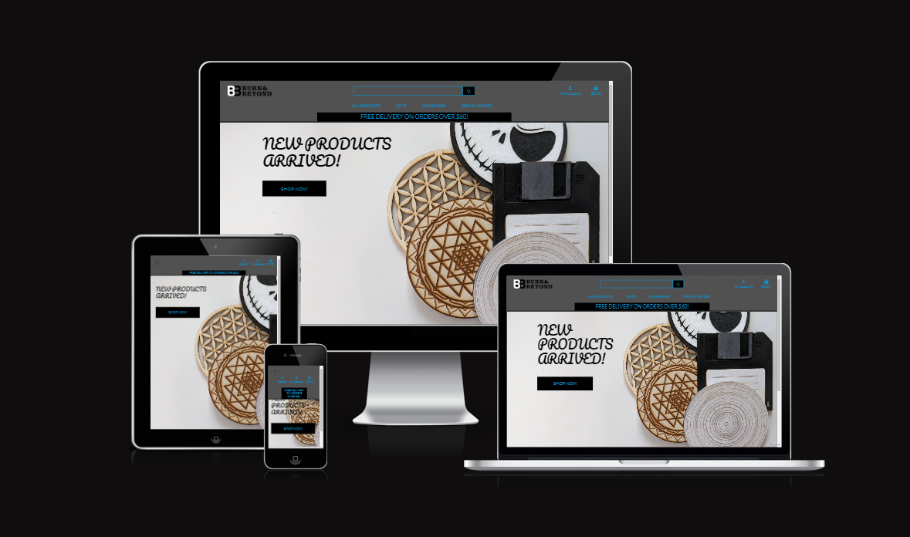

# Burn and Beyond Webshop Database Design

## Overview

This database design is for BUrn and Beyond Webshop ecommerce site application that is a fully functioning ecommerce website filled with handmade and laser-cut products. The application includes user authentication, products, purchasing system and account management. I have used a relation database (sql) scheme and I have deployed the database to [elephantsql](https://www.elephantsql.com/).




## Table of Contents

* [Burn and Beyond Database Design](#Burn-and-Beyond-Webshop-Database-Design)
  * [Overview](#overview)
  * [Table of Contents](#table-of-contents)
  * [Database Schema](#database-schema)
    * [Category](#category)
    * [Product](#Product)
    * [UserProfile](#userprofile)
    * [Order](#order)
    * [OrderLineIem](#orderlineitem)
  * [ER Diagram](#er-diagram)
  * [Sample Queries](#sample-queries)

## Database Schema

### Category

- **Columns:**
  - `name` = models.CharField(max_length=254)
  - `friendly_name` = models.CharField(max_length=254, null=True, blank=True)

### Product

- **Columns:**
  - `category` = models.ForeignKey('Category', null=True, blank=True, on_delete=models.SET_NULL)
  - `sku` = models.CharField(max_length=254, null=True, blank=True)
  - `name` = models.CharField(max_length=254)
  - `description` = models.TextField()
  - `has_sizes` = models.BooleanField(default=False, null=True, blank=True)
  - `price` = models.DecimalField(max_digits=6, decimal_places=2)
  - `rating` = models.DecimalField(max_digits=6, decimal_places=2, null=True, blank=True)
  - `image_url` = models.URLField(max_length=1024, null=True, blank=True)
  - `image` = models.ImageField(null=True, blank=True)

### UserProfile

- **Columns:**
  - `user` = models.OneToOneField(User, on_delete=models.CASCADE)
  - `default_phone_number` = models.CharField(max_length=20, null=True, blank=True)
  - `default_street_address1` = models.CharField(max_length=80, null=True, blank=True)
  - `default_street_address2` = models.CharField(max_length=80, null=True, blank=True)
  - `default_town_or_city` = models.CharField(max_length=40, null=True, blank=True)
  - `default_county` = models.CharField(max_length=80, null=True, blank=True)
  - `default_postcode` = models.CharField(max_length=20, null=True, blank=True)
  - `default_country` = CountryField(blank_label='Country', null=True, blank=True)

### Order

- **Columns:**
  - `order_number` = models.CharField(max_length=32, null=False, editable=False)
  - `user_profile` = models.ForeignKey(UserProfile, on_delete=models.SET_NULL, null=True, blank=True, related_name='orders')
  - `full_name` = models.CharField(max_length=50, null=False, blank=False)
  - `email` = models.EmailField(max_length=254, null=False, blank=False)
  - `phone_number` = models.CharField(max_length=20, null=False, blank=False)
  - `country` = CountryField(blank_label='Country *', null=False, blank=False)
  - `postcode` = models.CharField(max_length=20, null=True, blank=True)
  - `town_or_city` = models.CharField(max_length=40, null=False, blank=False)
  - `street_address1` = models.CharField(max_length=80, null=False, blank=False)
  - `street_address2` = models.CharField(max_length=80, null=True, blank=True)
  - `county` = models.CharField(max_length=80, null=True, blank=True)
  - `date` = models.DateTimeField(auto_now_add=True)
  - `delivery_cost` = models.DecimalField(max_digits=6, decimal_places=2, null=False, default=0)
  - `order_total` = models.DecimalField(max_digits=10, decimal_places=2, null=False, default=0)
  - `grand_total` = models.DecimalField(max_digits=10, decimal_places=2, null=False, default=0)
  - `original_bag` = models.TextField(null=False, blank=False, default='')
  - `stripe_pid` = models.CharField(max_length=254, null=False, blank=False, default='')

### OrderLineItem

- **Columns:**
  - `order` = models.ForeignKey(Order, null=False, blank=False, on_delete=models.CASCADE, related_name='lineitems')
  - `product` = models.ForeignKey(Product, null=False, blank=False, on_delete=models.CASCADE)
  - `product_size` = models.CharField(max_length=2, null=True, blank=True)
  - `quantity` = models.IntegerField(null=False, blank=False, default=0)
  - `lineitem_total` = models.DecimalField(max_digits=6, decimal_places=2, null=False, blank=False, editable=False)

## ER Diagram

Include an Entity-Relationship (ER) diagram to illustrate the relationships between entities in the database.


## Sample Queries

Include some sample SQL queries that demonstrate how to interact with the database.

```sql
-- Example Retrieve all categories
SELECT * FROM Category;

-- Example Retrieve products with their categories:
SELECT Product.*, Category.name AS category_name
FROM Product
LEFT JOIN Category ON Product.category_id = Category.name;

-- Example Retrieve user profiles with their associated user information:
SELECT UserProfile.*, User.*
FROM UserProfile
INNER JOIN User ON UserProfile.user_id = User.id;

-- Example Retrieve orders with their associated line items and product details:
SELECT Order.*, OrderLineItem.*, Product.*
FROM Order
LEFT JOIN OrderLineItem ON Order.order_number = OrderLineItem.order_id
LEFT JOIN Product ON OrderLineItem.product_id = Product.id;
```
