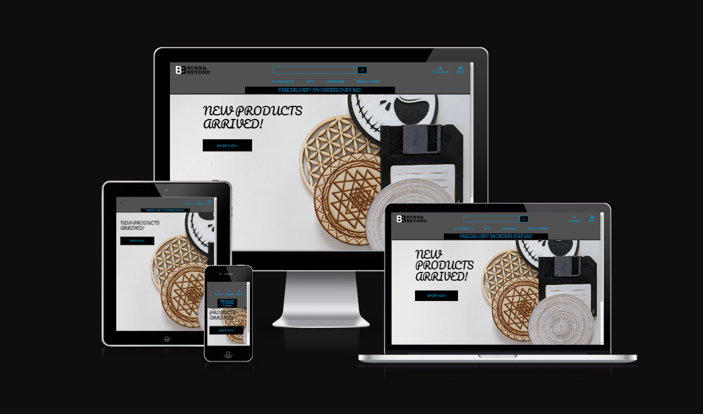
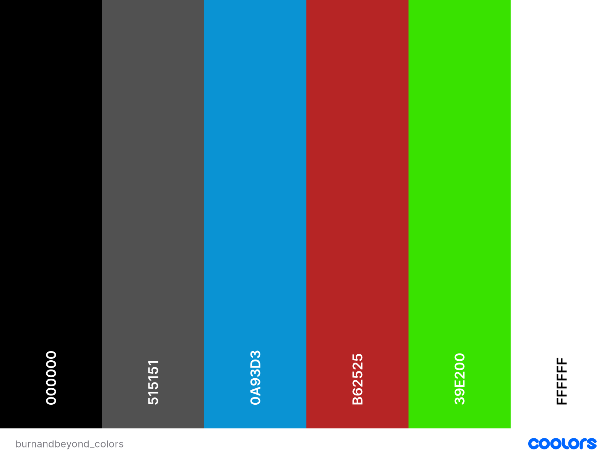

# Burn and Beyond Webshop

Hello and thank you for choosing Burn and Beyond Webshop for your laser-cut product needs! We are thrilled to introduce you to a world of precision, creativity, and craftsmanship through our unique range of laser-cut products. Whether you're looking to add a touch of elegance to your home, find the perfect gift, we have something special for everyone.

[Live link](Uhttps://burn-and-beyond-webshop-a7b5a0afa267.herokuapp.com/)

---

## CONTENTS

* [Burn and Beyond Webshop](#Burn-and-Beyond-Webshop)
  * [CONTENTS](#contents)
  * [User Experience (UX)](#user-experience-ux)
    * [Initial Discussion](#initial-discussion)
      * [Key information for the site](#key-information-for-the-site)
    * [User Stories](#user-stories)
      * [Client Goals](#client-goals)
      * [First Time Visitor Goals](#first-time-visitor-goals)
      * [Returning Visitor Goals](#returning-visitor-goals)
      * [Frequent Visitor Goals](#frequent-visitor-goals)
  * [Design](#design)
  * [Database](#database)
    * [Colour Scheme](#colour-scheme)
    * [Typography](#typography)
    * [Imagery](#imagery)
    * [Wireframes](#wireframes)
    * [Desktop view wireframes](#desktop-view-wireframes)
    * [Mobile and tablet view wireframes](#mobile-and-tablet-view-wireframes)
  * [Features](#features)
    * [General features on each page](#general-features-on-each-page)
    * [Future Implementations](#future-implementations)
    * [Accessibility](#accessibility)
  * [Technologies Used](#technologies-used)
    * [Languages Used](#languages-used)
    * [Frameworks, Libraries \& Programs Used](#frameworks-libraries--programs-used)
  * [Deployment \& Local Development](#deployment--local-development)
    * [Deployment](#deployment)
    * [Local Development](#local-development)
      * [How to Fork](#how-to-fork)
      * [How to Clone](#how-to-clone)
  * [Testing](#testing)
  * [Credits](#credits)
    * [Code Used](#code-used)
    * [Content](#content)
    * [ Media](#media)
    * [ Acknowledgments](#acknowledgments)

---

## User Experience (UX)

### Initial Discussion

Burn and Beyond webshop is a fully functioning Ecommerce web application which hosts various laser-cut goods in categories like: Home Decor and Gifts.
This site exist because of my own personal goal which is to eventually sell my laser-cut products online.

#### Key information for the site

In this site my goal was to create a fully functioning ecommerce web application with real payments later on. I have used django framework, stripe and Amazon web services to accomplish it.
The users will be able to:

* Easily navigate on the site
* Create an account
* Log-in to account
* Log-out
* Place purchases
* Browse products
* Filter products
* Save default shipping information
* Allow superusers to delete products
* Allow superusers to update products
* Allow superusers to create products

I am going to go into details in the user stories!

### User Stories

#### Client Goals

* Navigate on the site.
* Register an account.
* Log-in to the account.
* Log-out of an account.
* Receive an email confirmation after registering.
* Quickly identify product deals.
* View a list of products.
* Have a personalised user profile.
* Sort a list of available products.
* Sort a specific category of products
* Sort multiple categories of products simultaneously.
* Search for products by name and description.
* Easily select the quantity and size (if avaliable).
* Place an order.
* Review and list previous orders
* Get email confirmation about the order placed.
* Contact the shop via form.

#### First Time Visitor Goals

* Navigate on the site.
* Register an account.
* Log-in to the account.
* Log-out of an account.
* Receive an email confirmation after registering.
* Quickly identify product deals.
* View a list of products.
* Have a personalised user profile.
* Sort a list of available products.
* Sort a specific category of products
* Sort multiple categories of products simultaneously.
* Search for products by name and description.
* Easily select the quantity and size (if avaliable).
* Place an order.
* Review and list previous orders
* Get email confirmation about the order placed.
* Leave comment on Products.
* Leave a rating on products.
* Contact the shop via form.

#### Returning Visitor Goals

* Navigate on the site
* Register an account.
* Log-in to the account.
* Log-out of an account.
* Receive an email confirmation after registering.
* Quickly identify product deals.
* View a list of products.
* Have a personalised user profile.
* Sort a list of available products.
* Sort a specific category of products
* Sort multiple categories of products simultaneously.
* Search for products by name and description.
* Easily select the quantity and size (if avaliable).
* Place an order.
* Review and list previous orders
* Get email confirmation about the order placed.
* Leave comment on Products.
* Leave a rating on products.
* Contact the shop via form.

#### Frequent Visitor Goals

* Navigate on the site
* Register an account.
* Log-in to the account.
* Log-out of an account.
* Receive an email confirmation after registering.
* Quickly identify product deals.
* View a list of products.
* Have a personalised user profile.
* Sort a list of available products.
* Sort a specific category of products
* Sort multiple categories of products simultaneously.
* Search for products by name and description.
* Easily select the quantity and size (if avaliable).
* Place an order.
* Review and list previous orders
* Get email confirmation about the order placed.
* Leave comment on Products.
* Leave a rating on products.
* Contact the shop via form.

---

## Design

## Database

- [Database design considerations](DATABASE_README.md)

### Colour Scheme

I have chosen a modern sceme for this project and tried to make it interesting, fun and special.

I like to include a palette of the colour scheme here, my favourite site for creating a colour palette is [coolors](https://coolors.co/), but there are lots of other sites that also do the same thing, like [ColorSpace](https://mycolor.space/?hex=%23F5F5F5&sub=1), [Muzli Colors](https://colors.muz.li/), [Adobe Colour Wheel](https://color.adobe.com/create/color-wheel) and [Canva](https://www.canva.com/colors/color-palette-generator/) to name a few.

.

### Typography

I have chosen Lato and Pacifico google font family.

[Lato](https://fonts.google.com/specimen/Lato)
[Pacifico](https://fonts.google.com/specimen/Pacifico/about)

I chose for this font family because I think it appeares to be something fit well into my project.
I think it is an accessible friendly font because the characters are easy to read.

[Google Fonts](https://fonts.google.com/) is a popular choice for importing fonts to use in your project, as it doesn't require you to download the fonts to use them.

### Imagery

I used colourful icon images for this project for the prducts and a logo generator for my brand logo.
I used a favicon crator for my favicon.
The product images are my own products I have developed with my laser-cutter and my mom's hand crochet products.

I have used an online favicon creator for the favicon and logo maker to create the shop logo.

[Favicon creator](https://favicon.io/)
[Logo Maker](https://logomakr.com/)

### Wireframes

### Desktop view wireframes

[Home page](/static/images/home%20screen%20desktop.png)

[Product Page](/static/images/Products%20desktop.png)

[Login page](/static/images/Sign%20in%20desktop.png)

[Resigter page](/static/images/Sign%20Up%20Desktop.png)

[Log Out Page](/static/images/Sign%20out%20desktop.png)

### Mobile and tablet view wireframes

[Home page](/static/images/home%20screen%20mobile_tablet.png)

[Product Page](/static/images/Products%20Mobile.png)

[Login page](/static/images/Sign%20in%20mobile.png)

[Register page](/static/images/Sign%20up%20mobile.png)

[Log Out Page](/static/images/sign%20out%20mobile.png)

There are lots of different options to create your wireframes - Code Institute students can access [Balsamiq](https://balsamiq.com/) as part of the course.

Some other options include [Figma](https://www.figma.com/), [AdobeXD](https://www.adobe.com/products/xd.html), [Sketch](https://www.sketch.com/?utm_source=google&utm_medium=cpc&adgroup=uxui&device=c&matchtype=e&utm_campaign=ADDICTMOBILE_SKETCH_GAD_DG_UK_T1_ALWAYS-ON_S_TRF_PROS_BRAND&utm_term=sketch&utm_source=google&utm_medium=cpc&utm_content=TOF_BRND__generic&hsa_acc=8710913982&hsa_cam=16831089317&hsa_grp=134620695759&hsa_ad=592060065319&hsa_src=g&hsa_tgt=kwd-14921750&hsa_kw=sketch&hsa_mt=e&hsa_net=adwords&hsa_ver=3&gclid=Cj0KCQjwr4eYBhDrARIsANPywCjRIFn93DMezYnsyE5Fic_8l8kynJtut0GYMU01TiohHjwziFtlH0gaAhteEALw_wcB) and [Mockup](https://apps.apple.com/us/app/mockup-sketch-ui-ux/id1527554407) to name just a few! Or you can even go old school and get those wireframes completed using pen and paper. Just snap an image of the completed wireframes to add the images to the R

## Features

### General features on each page

The website contains:

- Home page
- User page
- Products Page
- Shopping Bag page
- Checkout Page
- Login page
- Logout Page
- Register Page

These pages DOM are modified by the python code Django and jinja2 template syntax.

All pages on the website are responsive and have:

- A favicon in the browser tab.

[Favicon tab](/static/images/favicon_tab.png)

- A header with brand logo and navbar.

[Navbar screenshot](/static/images/navbar.png)

- A footer with my own social links.

[Footer screenshot](/static/images/footer.png)

- Home page:

[Home Page](/static/images/home_page.png)

- User Page:

[User Page](static/images/userpage.png)

- Product Page:

[Product Page](static/images/productspage.png)

- Shopping Bag Page:

[Shopping Bag](static/images/shoppingbag.png)

- Checkout Page:

[Checkout Page](static/images/checkoutpage.png)

- Login page:

[Login Page](static/images/loginpage.png)

- Logout Page:

[Logout Page](static/images/logoutpage.png)

- Register Page:

[Register Page](static/images/registerpage.png)

### Future Implementations

* Comment and rate products
* Contact the Store
* Login using social accounts
* Allow superusers to add categories
* Allow superusers to edit categories
* Allow superusers to delete categories
* Allow users and superusers to upload profile image
* Switch between light and dark theme

### Accessibility

I have been mindful during coding to ensure that the website is as accessible friendly as possible. I have achieved this by:

- Using semantic HTML.
- Using descriptive alt attributes on images on the site.
- Ensuring that there is a sufficient colour contrast throughout the site.
- Ensuring menus are accessible.
- Using rel attributes on the anchor tags.

## Technologies Used

### Languages Used

HTML, CSS, Javascript, Python were used to create this website.
I used Flask login method and jinja2 language and templating.
The database is PSQL.

### Frameworks, Libraries & Programs Used

Balsamiq - Used to create wireframes.

Git - For version control.

Github - To save and store the files for the website.

Bootstrap v4.6.2 - The framework for the website. Code for the navigation bar, carousel, cards and form were used and modified. Additional CSS styling was also implemented in base.css.

Google Fonts - To import the fonts used on the website.

Font Awesome - For the iconography on the website.

Google Dev Tools - To troubleshoot and test features, solve issues with responsiveness and styling.

Heroku - To deploy the project.

Elephant SQL - To host my database.

[Tiny PNG](https://tinypng.com/) To compress images.

[Birme](https://www.birme.net/) To resize images and change to webp format.

[Favicon.io](https://favicon.io/) To create favicon.

[Am I Responsive?](http://ami.responsivedesign.is/) To show the website image on a range of devices.

[Bootstrap v4.6](https://getbootstrap.com/docs/4.6/getting-started/introduction/) To develop front end appearence using pre-coded CSS.

[Flaticon](https://www.flaticon.com/) To download nice png icons. Flaticon allows you to download entire icon packs in various styles. You can filter by category, style, and color to find the pack that suits your needs.

[Logomakr](https://logomakr.com/) To create the brand logo.

[Freepik](https://www.freepik.com) To downloag images for the categories.

[Bulma](https://bulma.io/) Css framework used for standardise font-awesome icons.

---

## Deployment & Local Development

### Deployment

- Migrate your database:

- Register on ElephantSQL
- Navigate to ElephantSQL.com and click “Log in”
- Select “Sign in with GitHub”
- Authorise ElephantSQL with your selected GitHub account
  \*In the Create new team form:
  Add a team name (your own name is fine)
  Read and agree to the Terms of Service
  Select Yes for GDPR
  Provide your email address
  Click “Create Team”
- Your account is successfully created!
- Click “Create New Instance”
  \*Set up your plan
  Give your plan a Name (this is commonly the name of the project)
  Select the Tiny Turtle (Free) plan
  You can leave the Tags field blank
- Select “Select Region”
- Select a data center near you
- Then click “Review”
- Check your details are correct and then click “Create instance”
- Return to the ElephantSQL dashboard and click on the database instance name for this project
- In the URL section, clicking the copy icon will copy the database URL to your clipboard
- Leave this tab open, we will come back here later

- In your IDE workspace:

- In the terminal, install dj_database_url and psycopg2, both of these are needed to connect to your external database

 pip3 install dj_database_url==0.5.0 psycopg2

- Update your requirements.txt file with the newly installed packages

   pip freeze > requirements.txt

- In your settings.py file, import dj_database_url underneath the import for os

  import os
  import dj_database_url

Scroll to the DATABASES section and update it to the following code, so that the original connection to sqlite3 is commented out and we connect to the new ElephantSQL database instead. Paste in your ElephantSQL database URL in the position indicated

 # DATABASES = {
 #     'default': {
 #         'ENGINE': 'django.db.backends.sqlite3',
 #         'NAME': os.path.join(BASE_DIR, 'db.sqlite3'),
 #     }
 # }
     
 DATABASES = {
     'default': dj_database_url.parse('your-database-url-here')
 }

DO NOT commit this file with your database string in the code, this is temporary so that we can connect to the new database and make migrations. We will remove it in a moment.

In the terminal, run the showmigrations command to confirm you are connected to the external database

 python3 manage.py showmigrations

If you are, you should see a list of all migrations, but none of them are checked off

- Migrate your database models to your new database

  python3 manage.py migrate

- Load in the fixtures. Please note the order is very important here. We need to load categories first

   python3 manage.py loaddata categories

- Then products, as the products require a category to be set

  python3 manage.py loaddata products

- Create a superuser for your new database

  python3 manage.py createsuperuser

- Finally, to prevent exposing our database when we push to GitHub, we will delete it again from our settings.py - we’ll set it up again  using an environment variable in the next video - and reconnect to our local sqlite database. For now, your DATABASE setting in the settings.py file should look like this

DATABASES = {
     'default': {
         'ENGINE': 'django.db.backends.sqlite3',
         'NAME': os.path.join(BASE_DIR, 'db.sqlite3'),
     }
 }

### Local Development

#### How to Fork

To fork the Nmyhi/burnandbeyond-webshop:

1. Log in (or sign up) to Github.
2. Go to the repository for this project, Nmyhi/burnandbeyond-webshop.
3. Click the Fork button in the top right corner.

#### How to Clone

To clone the Nmyhi/burnandbeyond-webshop:

1. Log in (or sign up) to GitHub.
2. Go to the repository for this project, Nmyhi/burnandbeyond-webshop.
3. Click on the code button, select whether you would like to clone with HTTPS, SSH or GitHub CLI and copy the link shown.
4. Open the terminal in your code editor and change the current working directory to the location you want to use for the cloned directory.
5. Type 'git clone' into the terminal and then paste the link you copied in step 3. Press enter.

## Testing

Testing was ongoing throughout the entire build. I utilised Chrome developer tools while building to pinpoint and troubleshoot any issues as I went along.

I have created the full testing documentation which collects all the information into a test sheet. [Testing documentation](TESTING.md)

## Credits

- [Online tutorial](https://betterprogramming.pub/a-detailed-guide-to-user-registration-login-and-logout-in-flask-e86535665c07 "Tutorial for Flask-login") Was used for creating the registration login and logout functionality using Flask-login.
- [Online documentations](https://www.w3schools.com/ "online documentation for html") was used for researching html css and javaScript elements, properties, attributes and functions.
- [Google](https://www.google.com/ "I think I do not have to introduce google") was used for researching.

### Code Used

In the project I used small code blocks from the online documentations and other resources I have highlighted in the credits section as well.

### Content

I have made the project myself.

###  Media

I have made / downloaded the media myself using the sources I have highighted before.

###  Acknowledgments

- Jubril Akolade - came up with some things I'd have easily missed and was a really good and professional guide.
- Callum Jones - for turning up consistently and offering helpful advice and tips and kept track on my journey.
